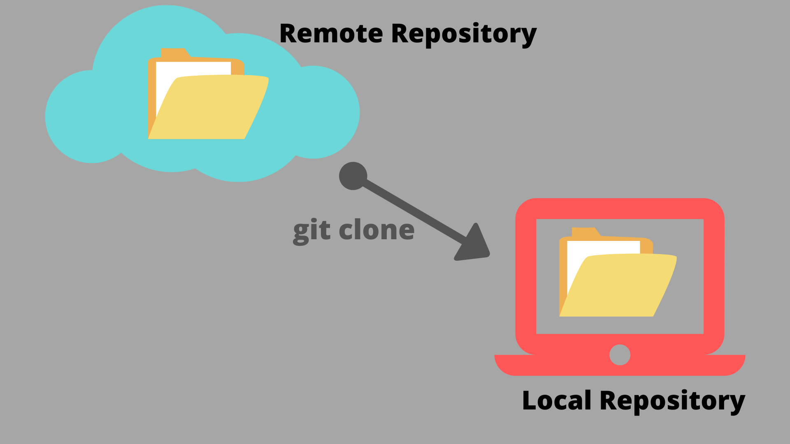

### Git Clone

In order to start working on an established project, it is necessary to get a (local) copy of the project. This is done with the `clone` command.



For example, I could clone the project with all this slides, by typing

```
git clone https://github.com/profburke/git101
```

_Let's take a look at what that did..._

There is now a directory on my computer, `git101` which has all the slides.

_Some terminology_

- A **repository** (_repo_ for short) is a directory containing the project's files as well as a sub-directory, named `.git`, that contains bookkeeping information used by Git.
- A repository found on another computer is known as a **remote repository** and is sometimes just referred to as a _remote_.
- A repository on your desktop or laptop is sometimes called a **local repository**, or a **working copy**.
- The _bookkeeping files_, mentioned above, forms what is essentially a database that contains details of all the changes made to the project since it was initialized.

_Read this later_

Since the remote repository and the local repository both have the _bookkeeping files_, you might wonder if there's any practical difference between the _remote_ and the _local_.

And you'd be right to wonder this. Git doesn't make any distinctions between different repositories for a given project. To Git, one repo is as good as another and it is only by convention that we consider a paricular repo the _source of truth_ for a project.

That's why Git is an example of a **distributed** version control system. Other version control systems, such as _subversion_ are not distributed and do have a distinguised central source of truth.


#### Try it Together

Let's try cloning. Enter the following command

```
git clone https://github.com/profburke/git101
```

Now, you too, should have a copy of all the slides on your computer.

#### Your Turn

1. Clone the following repository: https://github.com/profburke/git101-sample

We will use this repository for the remaining exercises. So let me or a TA know if you encounter problems cloning this repository.

#### Further Reading

- https://docs.github.com/en/repositories/creating-and-managing-repositories/cloning-a-repository

- https://git-scm.com/book/en/v2/Git-Basics-Getting-a-Git-Repository#_git_cloning

