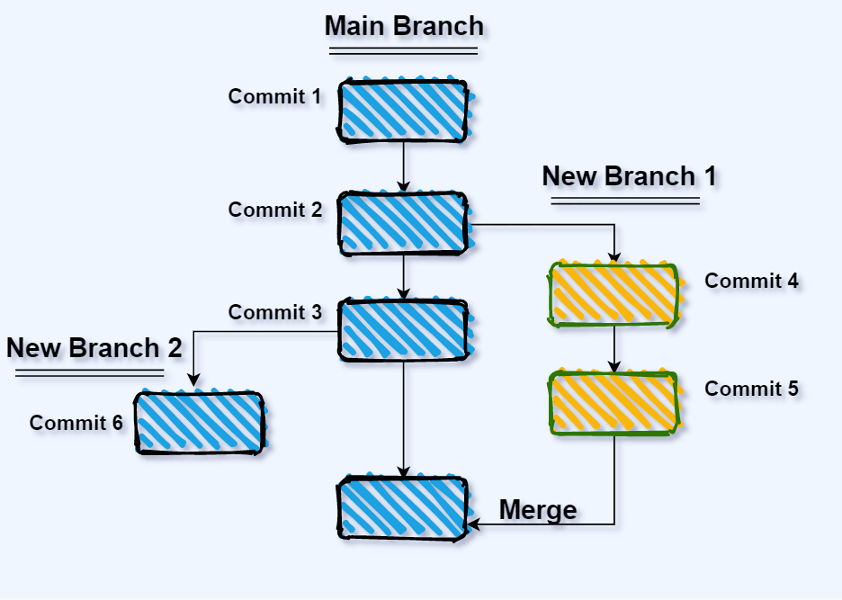

### Git Merge

We've now seen how to get changes from the remote into your (local) working directory. But suppose you are working on a branch named `cool-new-feature`. You've finished coding the new feature, tested it, and now you want the changes to appear in your main branch.

How do you get changes from one branch to the other?

I'm sure you've guessed from the title of this section: you use the Git `merge` command.



We need to make sure the main branch is current. Then we will merge in the changes from `cool-new-feature`

```
git checkout main
git merge cool-new-feature
```

The parameter for the `merge` command is the name of the branch that you want merged into your current branch.

#### Try it Together

We can also merge from the main branch to any of our other branches. (_More generally: from any branch to any other branch._)

First, let's make sure we're on the main branch:

```
git checkout main
```

Now, let's add the item `- Become proficient at merging` to `Todo.md`, and commit the change:

```
git add TODO.md
git commit -m "added merge item to TODO list"
```

We switch to our `experiment-1` branch:

```
git checkout experiment-1
```

Look at TODO.md and make sure our new item is *NOT* there.

Now, let's merge our change from the main branch:

```
git merge main
```

#### Your Turn

While still in the branch `experiment-1`, do the following:

1. Add `- Prepare for hackathon` to `TODO.md`.
2. Commit the change
3. Merge the change back into your main branch


#### Further Reading
