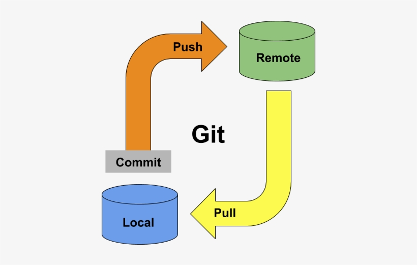

### Git Push

Earlier we glossed over the question of how do you get changes from your working directory to the remote directory. We'll take a look at that now.

The `push` command will take care of that for us.



```
git push
```

will incorporate the changes from your current branch into the remote repository.

There is one situation to watch out for. When you create a new branch in your working directory, if you attempt to push it you will receive an error message 

```
fatal: The current branch <your-branch> has no upstream branch.
To push the current branch and set the remote as upstream, use

    git push --set-upstream origin <your-branch>
```

This is because Git is quite flexible in terms of letting you specify which local branches map to which remote branches in which remote repositories. So it needs a little guidance, which is what `set-upstream` does.

With the appropriate command line switches to the `push` command you can avoid seeing this error. But, to be honest, on a new branch, I will `git push`, get the error, and then cut and paste the command that the git error message has so kindly provided for me.

#### Try it Together

To avoid stepping on each other's toes, let's create new branches named `branch-&lt;lastname&gt;-&lt;firstname&gt;.

Make sure you're in main. So, for example, the commands I should type are

```
git checkout main
git checkout -b branch-burke-matthew
```

Then in this new branch, create a short text file and commit it.

Now try and push

```
git push
```

In my case, I receive the following error:

```
fatal: The current branch branch-burke-matthew has no upstream branch.
To push the current branch and set the remote as upstream, use

    git push --set-upstream origin branch-burke-matthew
```

So I will copy the command git has shown me

```
 git push --set-upstream origin branch-burke-matthew

```
and I'm good to go. You should be able to do the same.

Just to be clear, the initial `--set-upstream` from a new branch only needs to be done once. For all subsequent pushes, a simple `git push` suffices.

#### Your Turn

1. Create an additional commit on your new branch. Either edit an existing file, or add a new file.
2. Now push the commits up to the remote repository.


#### Further Reading

- https://www.atlassian.com/git/tutorials/syncing/git-push

- https://docs.github.com/en/get-started/using-git/pushing-commits-to-a-remote-repository

